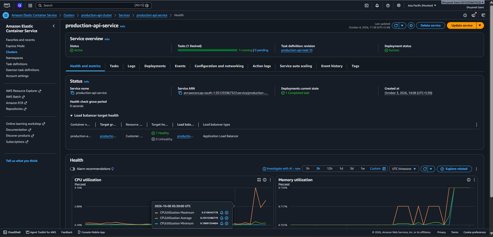
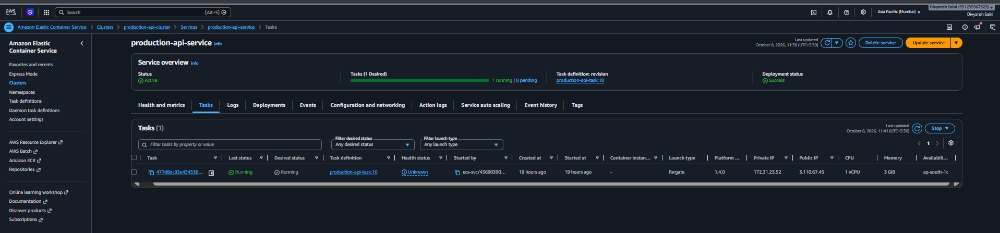
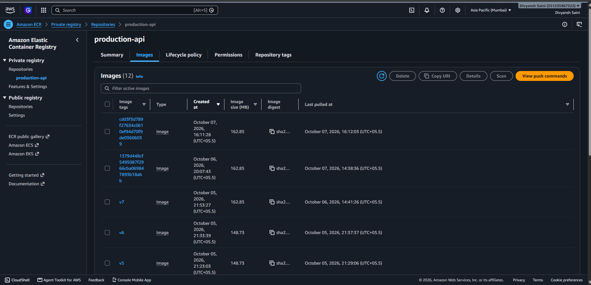
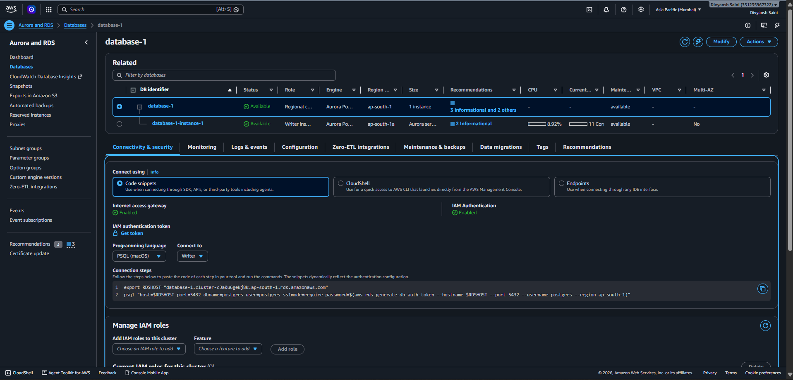
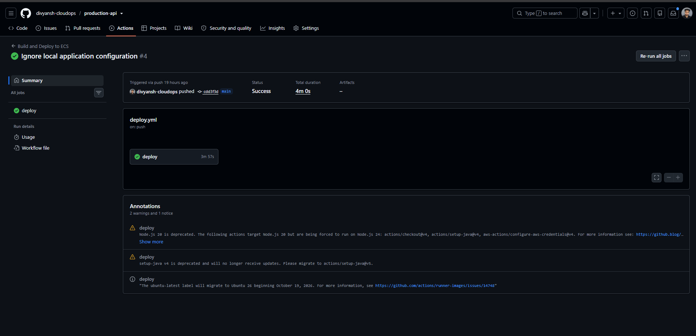
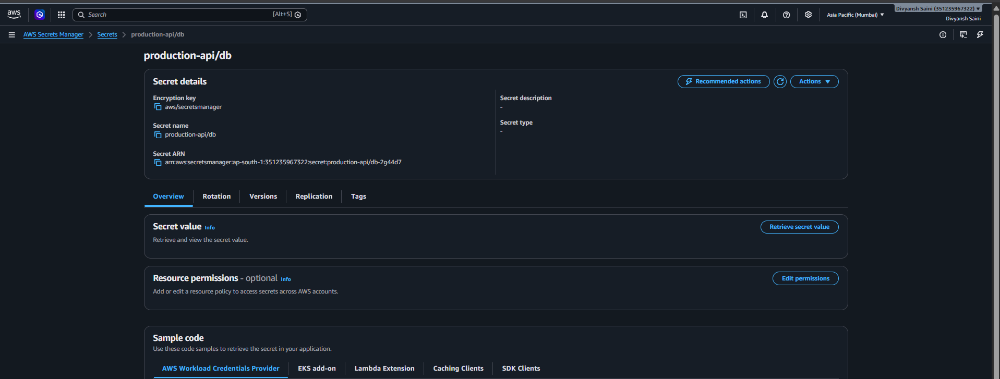
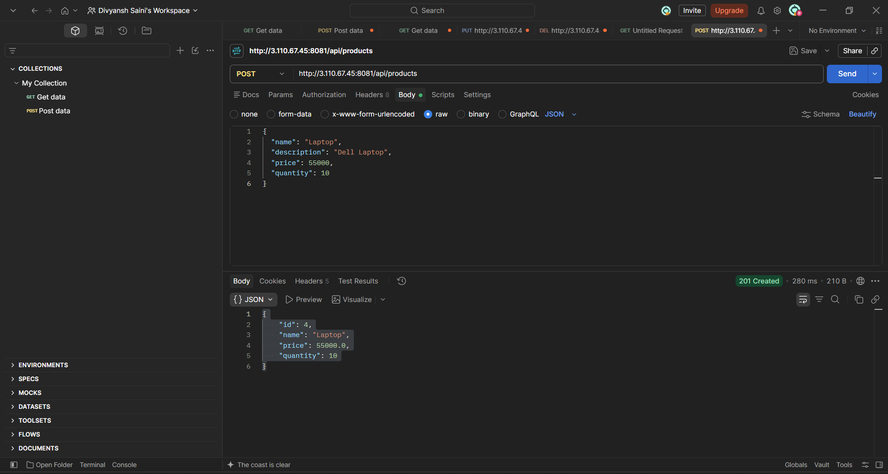
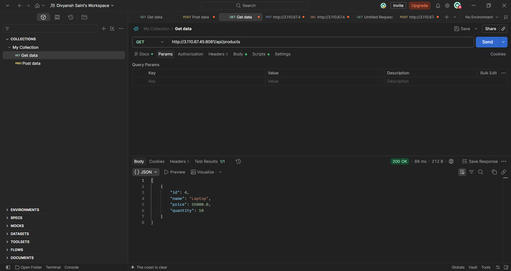
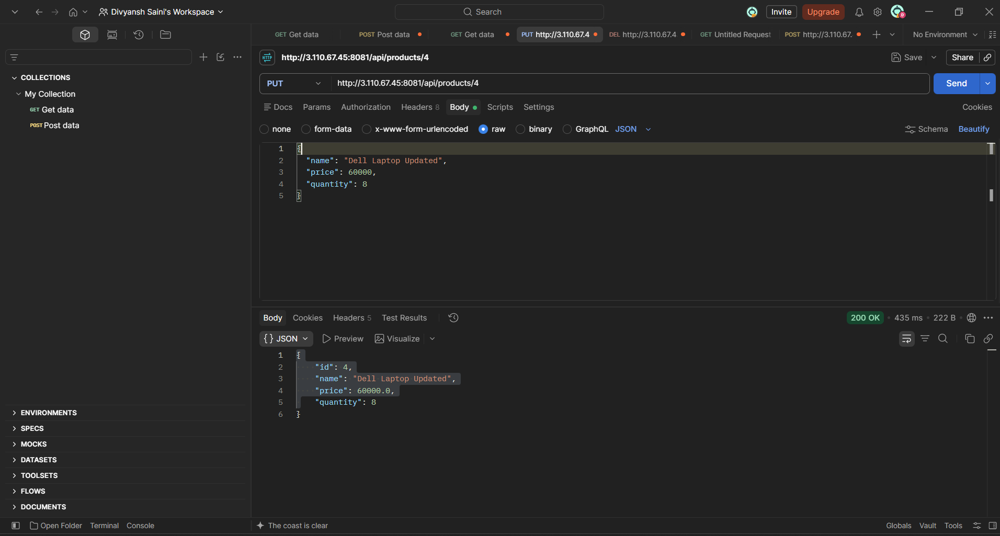
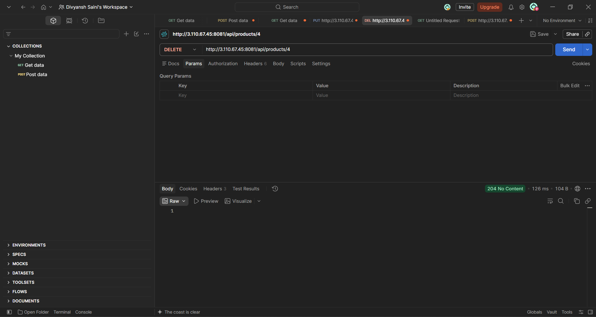

# 🚀 Production Grade Cloud Deployment API

  <b>Spring Boot • Docker • AWS • Terraform • GitHub Actions</b>

  A production-style Product Management REST API deployed on AWS with containerization, managed database, secure secrets management, infrastructure as code, and automated CI/CD.

---

## 🌟 Project Overview

This project demonstrates the complete journey of taking a Spring Boot REST API from local development to a production-style cloud deployment.

The application provides Product CRUD operations with PostgreSQL. Docker is used for containerization, Amazon ECR stores the Docker image, ECS Fargate runs the application, Aurora PostgreSQL provides the production database, AWS Secrets Manager protects sensitive credentials, Terraform manages infrastructure, and GitHub Actions automates the CI/CD process.

---

## 🏗️ Architecture

**Developer → GitHub → GitHub Actions → Docker → Amazon ECR → ECS Fargate → Application Load Balancer → Spring Boot API → Aurora PostgreSQL**

🔐 **Secrets:** AWS Secrets Manager  
🏗️ **Infrastructure:** Terraform  
🔄 **CI/CD:** GitHub Actions

---

## ✨ Key Features

- 🔗 RESTful Product Management API
- 🗄️ PostgreSQL database integration
- ☕ Spring Boot backend
- 🐳 Docker containerization
- 📦 Amazon ECR container registry
- ⚙️ Amazon ECS Fargate deployment
- ⚖️ Application Load Balancer
- 🔐 AWS Secrets Manager
- 🏗️ Terraform Infrastructure as Code
- 🔄 GitHub Actions CI/CD
- ❤️ Spring Boot Actuator health check
- 🧪 Postman API testing

---

## 🛠️ Tech Stack

**Backend:** Java 21, Spring Boot, Spring Data JPA  
**Database:** PostgreSQL, Aurora PostgreSQL  
**Containerization:** Docker  
**Cloud:** AWS  
**Deployment:** Amazon ECS Fargate  
**Registry:** Amazon ECR  
**Load Balancing:** Application Load Balancer  
**Security:** IAM, AWS Secrets Manager  
**Infrastructure:** Terraform  
**CI/CD:** GitHub Actions  
**Testing:** Postman  
**Monitoring:** Spring Boot Actuator

---

## 🔄 Deployment Flow

**1. Development**  
Spring Boot REST API is developed with PostgreSQL integration.

**2. Containerization**  
The application is packaged into a Docker image.

**3. Image Registry**  
The Docker image is pushed to Amazon ECR.

**4. ECS Deployment**  
Amazon ECS Fargate pulls the image and runs the application.

**5. Load Balancing**  
Application Load Balancer forwards incoming traffic to the ECS service.

**6. Database**  
The application connects to Aurora PostgreSQL.

**7. Security**  
Database credentials are securely provided through AWS Secrets Manager.

**8. Automation**  
GitHub Actions automates the build, Docker image creation, ECR push, and ECS deployment.

---

## ☁️ AWS Services Used

| AWS Service | Purpose |
|---|---|
| Amazon ECS Fargate | Runs the containerized application |
| Amazon ECR | Stores Docker images |
| Application Load Balancer | Routes application traffic |
| Aurora PostgreSQL | Managed production database |
| AWS Secrets Manager | Secure credential management |
| IAM | Access control and permissions |
| CloudWatch | Application/container logs |
| Terraform | Infrastructure as Code |

---

## 🔗 REST API

| Method | Endpoint | Description |
|---|---|---|
| GET | `/api/products` | Get all products |
| GET | `/api/products/{id}` | Get product by ID |
| POST | `/api/products` | Create a product |
| PUT | `/api/products/{id}` | Update a product |
| DELETE | `/api/products/{id}` | Delete a product |
| GET | `/actuator/health` | Application health |

### Example Product

    {
      "name": "Laptop",
      "price": 55000,
      "quantity": 10
    }

---

## 🐳 Docker

The application is containerized using Docker to provide a consistent and portable runtime environment.

**Application → Docker Image → Amazon ECR → ECS Fargate**

---

## 🔄 CI/CD Pipeline

**Git Push → GitHub Actions → Maven Build → Docker Build → Amazon ECR → ECS Deployment**

GitHub Actions automates the deployment workflow and reduces manual deployment steps.

---

## 🔐 Security

- 🔑 Database credentials are stored in AWS Secrets Manager
- 🚫 No database password is committed to GitHub
- 👤 IAM roles are used for AWS service access
- 🌐 Application and database are separated
- ⚙️ Configuration is managed using environment variables
- 🏗️ Infrastructure is managed through Terraform

---

## 🧪 API Testing

The deployed application was tested using Postman.

**POST** → Create Product  
**GET** → Retrieve Products  
**PUT** → Update Product  
**DELETE** → Delete Product

CRUD operations were successfully tested against the deployed application.

---

## ❤️ Health Check

Spring Boot Actuator provides an application health endpoint:

`GET /actuator/health`

Expected response:

    {
      "status": "UP"
    }

---

## 📸 Project Screenshots

### ☁️ ECS Production Deployment

### ⚙️ ECS Fargate Task

### 📦 Amazon ECR Docker Image

### 🗄️ Aurora PostgreSQL Database

### 🔄 GitHub Actions CI/CD

### 🔐 AWS Secrets Manager

### 🧪 Postman – Create Product

### 🔎 Postman – Get Products

### ✏️ Postman – Update Product

### 🗑️ Postman – Delete Product

---

## 📊 Project Highlights

- ✅ Built a complete Spring Boot REST API
- ✅ Integrated PostgreSQL database
- ✅ Containerized application using Docker
- ✅ Stored Docker images in Amazon ECR
- ✅ Deployed application using ECS Fargate
- ✅ Configured Application Load Balancer
- ✅ Connected application with Aurora PostgreSQL
- ✅ Secured credentials using AWS Secrets Manager
- ✅ Automated deployment using GitHub Actions
- ✅ Managed infrastructure using Terraform
- ✅ Tested production APIs using Postman

---

## 🎯 What This Project Demonstrates

This project demonstrates practical knowledge of:

**Backend Development → REST APIs → Database Integration → Docker → AWS → Cloud Deployment → Infrastructure as Code → CI/CD**

It represents a complete DevOps-oriented deployment workflow rather than only a local backend application.

---

## 🚀 Future Improvements

- 🔒 HTTPS using AWS Certificate Manager
- 🌐 Custom domain using Route 53
- 📈 ECS Auto Scaling
- 🚨 CloudWatch alarms
- 🔵🟢 Blue/Green deployment
- 📊 Improved monitoring and observability

---

## 👨‍💻 Author

### Divyansh Saini

**B.Tech CSE | DevOps & Cloud Enthusiast**

📍 Saharanpur, Uttar Pradesh

🔗 LinkedIn: https://linkedin.com/in/divyansh-saini-6a5703309/

---

## ⭐ Project Goal

The goal of this project is to demonstrate how a backend application can be developed, containerized, secured, deployed, and automated using modern cloud and DevOps practices.

**Build → Containerize → Deploy → Secure → Automate → Monitor**

---

⭐ If you found this project useful, consider giving the repository a star.